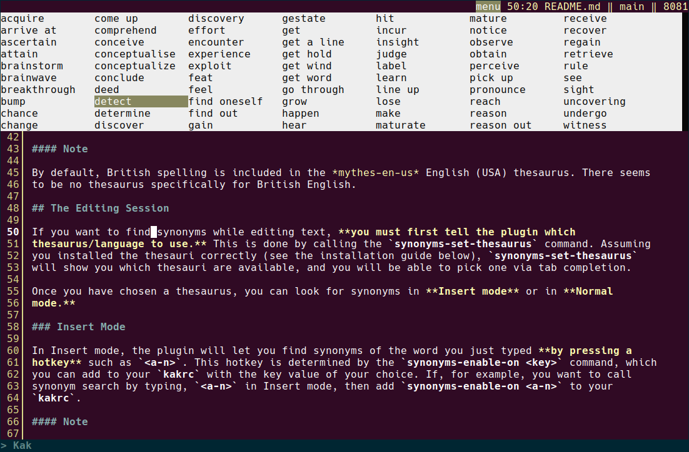

# synonyms.kak

This plugin for the Kakoune editor allows writers to replace target words by synonyms, in Insert or
Normal mode.

## The MyThes Collection

The plugin find synonyms by searching in a plain-text thesaurus file. The thesaurus files we use are
the **MyThes thesauri** designed for OpenOffice/LibreOffice. Your distribution should have them
packaged for you. In Debian bullseye, for example, the following 28 packages are available:

| Package      | Thesaurus                                                       |
|:-------------|:----------------------------------------------------------------|
| mythes-ar    | Arabic Thesaurus for LibreOffice                                |
| mythes-bg    | Bulgarian Thesaurus for LibreOffice                             |
| mythes-ca    | Catalan Thesaurus for LibreOffice                               |
| mythes-cs    | Czech Thesaurus for LibreOffice                                 |
| mythes-da    | Danish Thesaurus for LibreOffice                                |
| mythes-de-ch | German Thesaurus for OpenOffice.org/LibreOffice (Swiss Version) |
| mythes-de    | German Thesaurus for OpenOffice.org/LibreOffice                 |
| mythes-en-au | Australian English Thesaurus for OpenOffice.org                 |
| mythes-en-us | English (USA) Thesaurus for LibreOffice                         |
| mythes-es    | Spanish Thesaurus for LibreOffice                               |
| mythes-fr    | French Thesaurus for LibreOffice                                |
| mythes-gl    | Galician Thesaurus for LibreOffice                              |
| mythes-gug   | Guarani Thesaurus for LibreOffice                               |
| mythes-hu    | Hungarian Thesaurus for LibreOffice                             |
| mythes-id    | Indonesian Thesaurus for LibreOffice                            |
| mythes-is    | Icelandic Thesaurus for LibreOffice                             |
| mythes-it    | Italian Thesaurus for LibreOffice                               |
| mythes-lv    | Latvian Thesaurus for LibreOffice                               |
| mythes-ne    | Nepalese Thesaurus for LibreOffice                              |
| mythes-no    | Norwegian Thesaurus for LibreOffice                             |
| mythes-pl    | Polish thesaurus for LibreOffice/OpenOffice.org                 |
| mythes-pt-pt | Portuguese Thesaurus for LibreOffice                            |
| mythes-ro    | Romanian Thesaurus for LibreOffice                              |
| mythes-ru    | Russian Thesaurus for LibreOffice                               |
| mythes-sk    | Slovak Thesaurus for LibreOffice                                |
| mythes-sl    | Slovene Thesaurus for LibreOffice                               |
| mythes-sv    | Swedish Thesaurus for LibreOffice                               |
| mythes-uk    | Ukrainian Thesaurus for LibreOffice                             |

#### Note

By default, British spelling is included in the *mythes-en-us* English (USA) thesaurus. There seems
to be no thesaurus specifically for British English.

## The Editing Session

If you want to find synonyms while editing text, **you must first tell the plugin which
thesaurus/language to use.** This is done by calling the `synonyms-set-thesaurus` command. Assuming
you installed the thesauri correctly (see the installation guide below), `synonyms-set-thesaurus`
will show you which thesauri are available, and you will be able to pick one via tab completion.

Once you have chosen a thesaurus, you can look for synonyms in **Insert mode** or in **Normal
mode.**

### Insert Mode

In Insert mode, the plugin will let you find synonyms of the word you just typed **by pressing a
hotkey** such as `<a-n>`. This hotkey is determined by the `synonyms-enable-on <key>` command, which
you can add to your `kakrc` with the key value of your choice. If, for example, you want to call
synonym search by typing, `<a-n>` in Insert mode, then add `synonyms-enable-on <a-n>` to your
`kakrc`.

#### Note

Synonym search in Insert mode tolerates spaces after word end and extra characters (e.g., opening
braces, hyphens, and quotes) at word start. Which characters are tolerated at word start can be
configured by setting the `synonyms_skip` option to the regular expression of your choice. This
regular expression must be a character class in brackets. Default is [-_*"'`({[<].

### Normal Mode

In Normal mode, before looking for synonyms you will need to **select your target word**,
without extra characters at word start and without spaces at word end. Then call `synonyms-replace`
(alias: `syr`) to find a replacement for the target word. Multiple selections are allowed. Make sure
all selections are identical, however, because replacement will be based on the content of the main
selection.

## Screenshot

## Installation

Installation is manual. It involves two steps: installing the plugin script, and installing
thesauri.

### Installing the plugin script

Copy the `synonyms.kak` script somewhere in your autoload directory tree:

`$HOME/.config/kak/autoload/...`

### Installing thesauri

First, create a `synonyms` subdirectory of `$HOME/.config/kak/`:

`$HOME/.config/kak/synonyms`

Then, install the MyThes thesauri of your choice via your package manager. For example, to install
the Spanish thesaurus (mythes-es) on Debian, type:

`sudo apt install mythes-es`

on the command line.

Once installed, locate the directory where the thesaurus files have been placed (usually, this is
`/usr/share/mythes`), and copy these files to `$HOME/.config/kak/synonyms`. (As an alternative to
copying files, you can also create symlinks to them.) **The files you look after are those with the
.dat extension, thes_*.dat**. Disregard any files with extensions such as .aff, .dic, or .idx (they
are not thesauri and are used for other purposes).

#### Note

If you do not or cannot install MyThes thesauri via your package manager, then you may be able to
download them directly from the freedesktop/LibreOffice dictionary pages:

[freedesktop.org](https://cgit.freedesktop.org/libreoffice/dictionaries/tree/)

Search their directory tree for the language you are interested in (for example, **ar** for Arabic),
and download its thesaurus file (for example, **th_ar.dat**) before copying it to
`$HOME/.config/kak/synonyms`

## License

MIT

